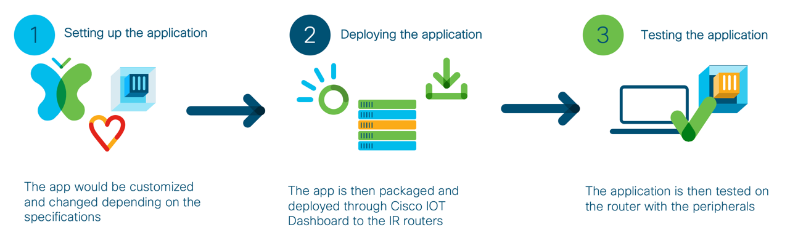

# GVE DevNet IOx Keypad App
Sample IOx application to demonstrate a simple keypad login for an IR Router


### High Level Design


## Contacts

* Josh Ingeniero (jingenie@cisco.com)


## Solution Components
* Flask
* Docker
* Python
* Pandas
* Cisco FMC API’s

## Installation:

#### Clone the repo
```console
git clone https://github.com/gve-sw/gve_devnet_iox_keypad_app
```
#### Set up a Python venv
First make sure that you have Python 3 installed on your machine. We will then be using venv to create
an isolated environment with only the necessary packages.

##### Install virtualenv via pip
```
$ pip install virtualenv
```

##### Create a new venv
```
Change to your project folder
$ cd GVE_DevNet_IOx_Keypad_App

Create the venv
$ virtualenv venv

Activate your venv
$ source venv/bin/activate
```

#### Install dependencies
```
$ pip install -r requirements.txt
```

## Setup:
You can deploy this prototype in a lab environment or on your own deployment.

## Usage:

### Python
Launch the Keypad App Server. Make sure that you have your venv activated.
```commandline
$ flask run --host=0.0.0.0 --port=5000
```

# Screenshots

### Keypad App


## License
Provided under Cisco Sample Code License, for details see [LICENSE](./LICENSE.txt)

## Code of Conduct
Our code of conduct is available [here](./CODE_OF_CONDUCT.md)

## Contributing
See our contributing guidelines [here](./CONTRIBUTING.md)

#### DISCLAIMER:
<b>Please note:</b> This script is meant for demo purposes only. All tools/ scripts in this repo are released for use "AS IS" without any warranties of any kind, including, but not limited to their installation, use, or performance. Any use of these scripts and tools is at your own risk. There is no guarantee that they have been through thorough testing in a comparable environment and we are not responsible for any damage or data loss incurred with their use.
You are responsible for reviewing and testing any scripts you run thoroughly before use in any non-testing environment.